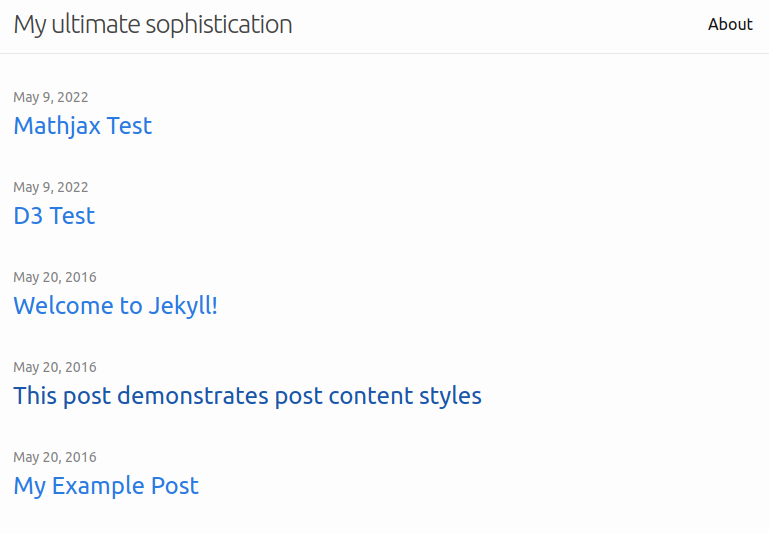

# Résumé + Blog
This is a new version of my résumé. The homepage is created using React while the blog is created using Jekyll.

## Preview



## Reference
- https://material.io/resources/icons/?style=baseline
- https://github.com/jekyll/minima/


## Make responsive images
```
docker build -t m2ng-github-io-responsive-images:latest src/responsive-images
docker run --rm -v "$PWD/apps/jekyll/m2ng/_assets/img:/app/img:ro" -v "$PWD/apps/jekyll/m2ng/assets/img:/app/dist:rw" m2ng-github-io-responsive-images:latest
```

## Take screenshot
```
docker build -t m2ng-github-io-screenshot:latest src/screenshot
docker run -t --init --cap-add=SYS_ADMIN -v "$PWD/src/screenshot/index.js:/app/index.js" --rm --name screenshot -v "$PWD/preview:/app/output" m2ng-github-io-screenshot:latest npm start
```